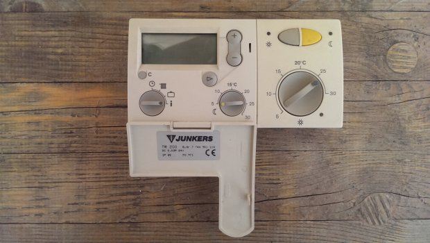

## Un po' di storia (potete anche saltarla)
Vi presento il mio (ormai ex) termostato:

> Ok, *non è proprio il mio*, però è per rendere l'idea.

Inutile dire che quando entrai per la prima volta in casa, la reazione che ebbi guardando quell'aggeggio
fu la stessa di un aborigeno australiano che vede uno smartphone per la prima volta: assoluto stupore.

Tempo qualche mese di assestamento nella mia nuova dimora e parte un thread sulla sostituzione del sopracitato
termostato. Inutile dire che la ricerca sul mercato ha prodotto risultati a dir poco sgradevoli:

* Termostati ultratecnologici con *lock-in* del produttore: >= 250 euro
* Termostati di fascia media con *lock-in* del produttore: 150 euro
* Termostati *scrausi* dei quali mi chiedo ancora il motivo della loro esistenza: 50 euro

I termini in corsivo sono quelli che mi hanno fatto prontamente allontanare dal centro commerciale e girare un
po' su Internet. Soluzioni fatte in casa con i vari Arduino, Raspberry, \[inserisci_qui_la_tua_board_preferita\]
ne ho trovate tante, più o meno complete. Ovviamente nessuna aderenza agli standard del settore - anche perché
non esistono, o almeno siamo ancora nella fase *il_mio_standard_è_migliore_per_cui_usa_il_mio*, che in pratica
si traduce in 48 standard diversi che tentano di tirare il mercato.

Non soddisfatto del disordine generale della comunità dell'open source, ho deciso di farmene uno io, da zero.
Progettazione, costruzione, sviluppo del software e tutto. Tanto perché non ho nulla di meglio da fare e non
volevo farmi mancare nulla.

Per quanto riguarda la voglia di standardizzare, ho deciso di usare API proprietarie REST (alla faccia del disordine)
che adatterò lentamente ad uno degli standard sul mercato che devo ancora scegliere.

Basta storia, andiamo sulla pratica.
