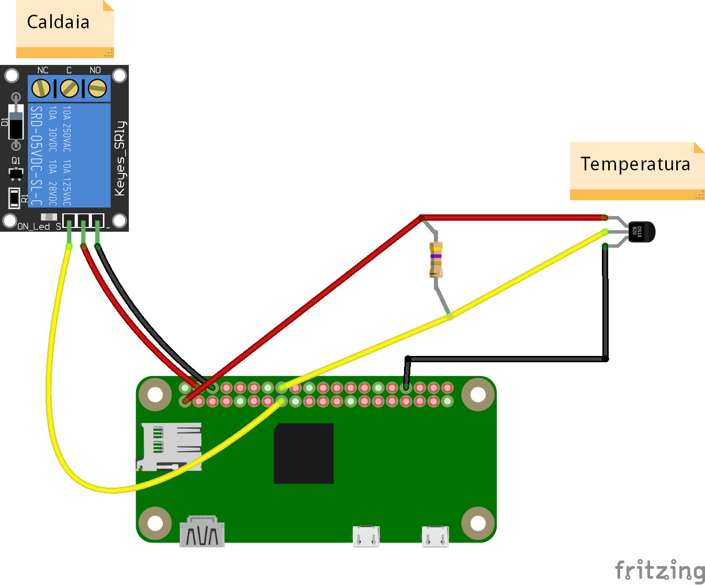

## Architettura hardware
Il termostato sarà un semplice relé supportato da una board Raspberry PI Zero W.
Lo schema di costruzione è disponibile in un file per [Fritzing](http://fritzing.org/) disponibile [in questo repository](../../hardware/baremetal/thermostat_v1.fzz).

Come vedete la costruzione è banale. Tuttavia, per chi, come me, era alla prima esperienza di saldatura,
l'operazione è stata alquanto impegnativa. Ma vi assicuro che porterà grandi soddisfazioni. In ogni
caso, fatevi aiutare. Basi di elettronica (ma proprio basi, tipo sapere la differenza tra resistore e
condensatore) sono richieste.

La Raspberry PI Zero W (attenzione alla "W": indica che ha il supporto per il WiFi, fate attenzione perché
ne esiste anche una versione senza "W") è facilmente acquistabile su Internet, così come gli altri componenti.
Eventualmente affidatevi al vostro negozio di elettronico di fiducia. Ecco la lista della spesa:

* Raspberry PI Zero W ([pinout](https://pinout.xyz/))
* resistore da 4.7K
* sensore di temperatura DS18B20
* circuito relé ([tipo questo](http://amzn.eu/ec8kNKX), l'importante è che si attivi a 3.3V, vedremo in seguito cosa vuol dire)
* cavi elettrici fini (non quelli per la 220 V) di vario colore
* alimentatore USB (va bene anche quello per smartphone)
* tester/multimetro
