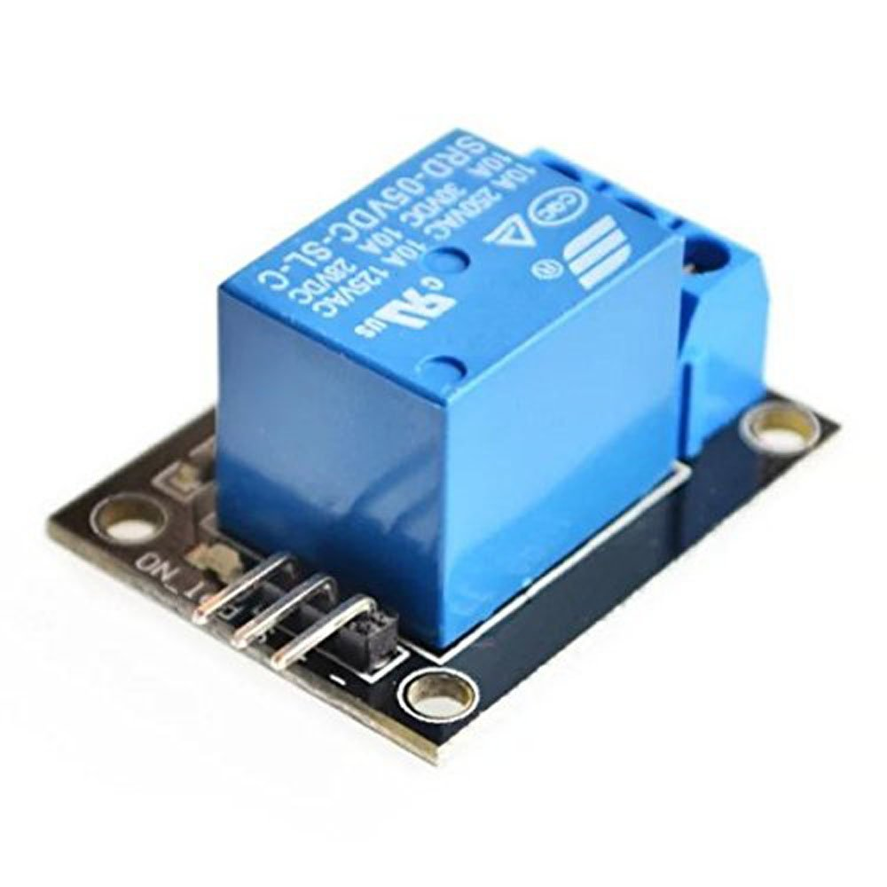
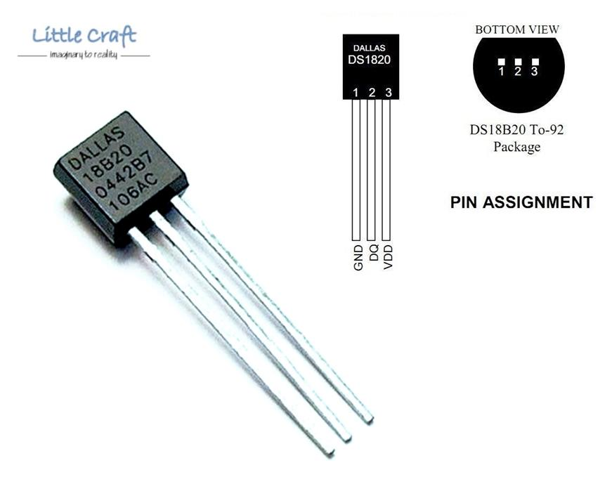

## Costruzione
La costruzione è talmente semplice che mi sembra inutile andare step-by-step sulle saldature dei singoli
componenti.  
La scelta dei pin è stata assolutamente personale. Ovviamente non vuol dire che potete scegliere dei pin a caso.

#### Circuito relè

La scheda o circuito relè è una scheda preassemblata con uno o più relè (dipende da cosa avete acquistato).
Il circuito include alcuni componenti di supporto necessari a rendere controllabile il relé
(il rettangolino blu con le viti) dalla vostra Rasp.
Su questo punto vorrei soffermarmi visto che qui ho fatto il mio primo errore. Ma partiamo con una piccola introduzione.

Un relè è un componente che, se opportunamente alimentato, chiude o apre un circuito sotto il suo controllo
a seconda della tensione applicata sul relé stesso. Quando si acquista un relé bisogna tenere conto di tre cose:

* la corrente e la tensione massime per il circuito controllato dal relè
* la tensione di alimentazione
* la tensione di attivazione

Per il carico massimo sul circuito controllato di solito i relè arrivano tutti a 250 V/10 A per cui direi che,
a meno che avete una centrale nucleare, dovrebbe andar bene.

La tensione di alimentazione di solito è 5 V. Accertatevene all'acquisto. L'alimentazione andrà collegata
ad [un pin 5 V](https://pinout.xyz/pinout/pin2_5v_power).

La tensione di attivazione è quella necessaria per comunicare al relè di aprire o chiudere il circuito
dall'altra parte (il circuito ON/OFF della caldaia). La tensione in questione è quella fornita dal pin
dati digitale a cui collegherete il pin dati della scheda relè (cavo giallo nello schema). Quando il pin
è impostato ad un valore alto (1 - HIGH), la Rasp emette una tensione di 3.3 V. A quel punto il relè chiude
il circuito sul contatto "NC" (normally closed) e lo apre nel contatto "NO" (normally open).
Abbassando il pin (0 - LOW), il relè invertirà la situazione: NC aperto, NO chiuso.

(schema o animazione funzionamento relè)

Peccando di disattenzione, ho acquistato per errore un relè che si attiva a 5 V. Me la sono cavata con un "magheggio" lato software, ma ve lo sconsiglio (onestamente non ho capito come abbia fatto a funzionare).
**Accertatevi che il relè si attivi a 3.3 V.**

Il circuito relè dispone di tre pin:

* alimentazione
* controllo
* terra

Il nome del pin è di solito identificato direttamente sulla scheda, in alternativa rivolgetevi al
produttore/venditore per ottenere un datasheet o un documento che contenga tali informazioni.

L'alimentazione andrà collegata ad un pin della Rasp che fornisca sufficiente tensione (di solito un pin 5 V).
Il pin di controllo (o pin dati) è quello che andrà alzato o abbassato digitalmente (via software) per
far lavorare il relè. Lo collegheremo quindi a un pin dati (GPIO) della Raspberry.
L'ultimo che rimane è il pin di terra che collegheremo ad un pin terra (GND).

#### Sensore di temperatura
Il sensore di temperatura è un DS18B20, un componentino minuscolo:

Il sensore dispone di tre pin:

* terra (1)
* dati/controllo (2)
* alimentazione (3)

Questo piccolo aggeggio è in grado di fare molte cose, tra cui attivare un allarme per un certo range
di temperatura e altro, ma le funzioni aggiuntive sono fuori dallo scopo di questo tutorial. Per saperne
di più potete consultare il [datasheet del sensore](https://datasheets.maximintegrated.com/en/ds/DS18B20.pdf).

Il sensore può essere collegato in vari modi (addirittura può operare in assenza di alimentazione sul pin 3),
ma noi useremo quello raccomandato dal produttore, indicato nello schema di costruzione che [abbiamo già visto
in un capitolo precedente](03-hardware-design.md).

Notate il resistore inserito nel circuito del sensore. Viene definita *resistenza di pull-up*. Serve per
stabilizzare la tensione che esce dal pin dati che, a quanto pare, è solito che non sia stabile nei circuiti
integrati. Il componente ha bisogno di distinguere chiaramentra valori alto e basso (1 e 0) per capire
chiaramente i messaggi che riceve.

> In realtà i pin digitali della Raspberry hanno tutti una resistenza di pull-up interna attivabile via software,
ma pare che non sia adeguata a questo uso, o almeno il produttore raccomanda sempre una resistenza esterna in
quanto diventa nota nel circuito - ciò a testimonianza del fatto non sono riuscito a trovare informazioni precise
sulla resistenza di pull-up interna alla Rasp, se non il fatto che sia presente e attivabile. In alcuni forum
sostengono che non sia sufficiente, noi per sicurezza ce ne mettiamo una.

Il sensore usa un protocollo particolare sul pin dati chiamato [1-Wire](https://en.wikipedia.org/wiki/1-Wire), un
protocollo che consente con un solo pin di fornire un canale per i dati e per l'alimentazione, tutto a basso consumo.
Un'altra proprietà interessante di questo protocollo è che, se avete più sensori di temperatura che implementano
il 1-Wire, possono essere collegati insieme (con un cavo solo).

#### Assemblaggio finale
A questo punto siamo pronti a collegare il tutto. Alla fine dovreste avere un risultato simile a questo:

(foto assemblaggio completo)

... TODO ...
