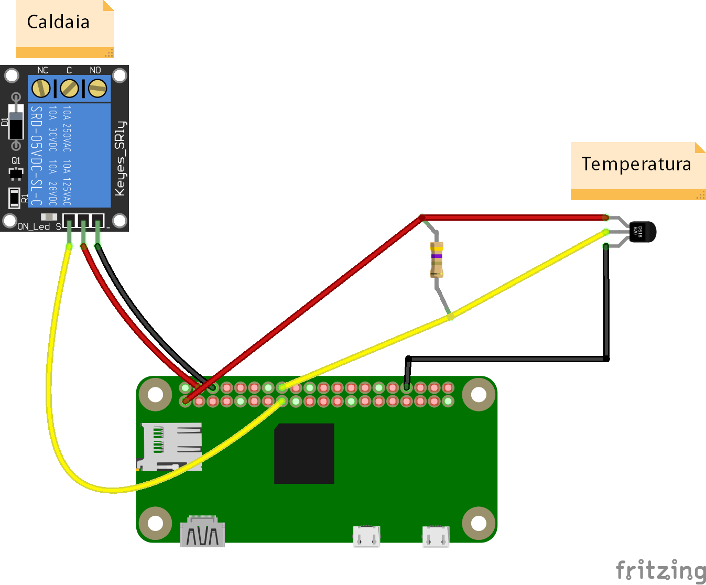

Raspberry PI Smart Thermostat tutorial
======================================

## Un po' di storia (potete anche saltarla)
Vi presento il mio (ormai ex) termostato:

> Ok, *non è proprio il mio*, però è per rendere l'idea.

Inutile dire che quando entrai per la prima volta in casa, la reazione che ebbi guardando quell'aggeggio
fu la stessa di un aborigeno australiano che vede uno smartphone per la prima volta: assoluto stupore.

Tempo qualche mese di assestamento nella mia nuova dimora e parte un thread sulla sostituzione del sopracitato
termostato. Inutile dire che la ricerca sul mercato ha prodotto risultati a dir poco sgradevoli:

* Termostati ultratecnologici con *lock-in* del produttore: >= 250 euro
* Termostati di fascia media con *lock-in* del produttore: 150 euro
* Termostati *scrausi* dei quali mi chiedo ancora il motivo della loro esistenza: 50 euro

I termini in corsivo sono quelli che mi hanno fatto prontamente allontanare dal centro commerciale e girare un
po' su Internet. Soluzioni fatte in casa con i vari Arduino, Raspberry, \[inserisci_qui_la_tua_board_preferita\]
ne ho trovate tante, più o meno complete. Ovviamente nessuna aderenza agli standard del settore - anche perché
non esistono, o almeno siamo ancora nella fase *il_mio_standard_è_migliore_per_cui_usa_il_mio*, che in pratica
si traduce in 48 standard diversi che tentano di tirare il mercato.

Non soddisfatto del disordine generale della comunità dell'open source, ho deciso di farmene uno io, da zero.
Progettazione, costruzione, sviluppo del software e tutto. Tanto perché non ho nulla di meglio da fare e non
volevo farmi mancare nulla.

Per quanto riguarda la voglia di standardizzare, ho deciso di usare API proprietarie REST (alla faccia del disordine)
che adatterò lentamente ad uno degli standard sul mercato che devo ancora scegliere.

Basta storia, andiamo sulla pratica.

## Funzionamento di una caldaia
TODO funzionamento base caldaia base, circuito ON/OFF

## Architettura hardware
Il termostato sarà un semplice relé supportato da una board Raspberry PI Zero W.
Lo schema di costruzione è disponibile in un file per [Fritzing](http://fritzing.org/) disponibile [in questo repository](../../hardware/baremetal/thermostat_v1.fzz).

Come vedete la costruzione è banale. Tuttavia, per chi, come me, era alla prima esperienza di saldatura,
l'operazione è stata alquanto impegnativa. Ma vi assicuro che porterà grandi soddisfazioni. In ogni
caso, fatevi aiutare. Basi di elettronica (ma proprio basi, tipo sapere la differenza tra resistore e
condensatore) sono richieste.

La Raspberry PI Zero W (attenzione alla "W": indica che ha il supporto per il WiFi, fate attenzione perché
ne esiste anche una versione senza "W") è facilmente acquistabile su Internet, così come gli altri componenti.
Eventualmente affidatevi al vostro negozio di elettronico di fiducia. Ecco la lista della spesa:

* Raspberry PI Zero W ([pinout](https://pinout.xyz/))
* resistore da 4.7K
* sensore di temperatura DS18B20
* circuito relé ([tipo questo](http://amzn.eu/ec8kNKX), l'importante è che si attivi a 3.3V, vedremo in seguito cosa vuol dire)
* cavi elettrici fini (non quelli per la 220 V) di vario colore
* alimentatore USB (va bene anche quello per smartphone)
* tester/multimetro

## Avvertenze e note sulla costruzione
La costruzione è semplice, tuttavia alcune avvertenze sui possibile pericoli, visto che comunque state
per comunicare con una caldaia.

1. Accertatevi che possiate farlo. Se la casa non è vostra, potreste non avere il permesso del proprietario
2. Accettate l'eventuale possibilità di fare danni e quindi di danneggiare la caldaia. Al di là della vita
(improbabile, ma non impossibile), danneggiare la caldaia potrebbe costarvi un po' di soldi, oltre che casa fredda
3. Ricordate che la caldaia **brucia gas** ed è quindi potenzialmente molto pericoloso giocarci come
se fosse una scheda Arduino con due LED. Il tutorial include una fase di test del termostato prima dell'installazione
**molto importante e che non va assolutamente saltata**.
4. Chiaramente non mi assumo nessuna responsabilità su qualunque danno o problema possiate avere.
Sappiate tuttavia che il termostato in questione mi scalda egregiamente da circa un anno.

## Costruzione
La costruzione è talmente semplice che mi sembra inutile andare step-by-step sulle saldature dei singoli
componenti.  
La scelta dei pin è stata assolutamente personale. Ovviamente non vuol dire che potete scegliere tre pin a caso.

#### Circuito relè
La scheda o circuito relè è una scheda preassemblata con uno o più relè (dipende da cosa avete acquistato).
Il circuito include alcuni componenti di supporto necessari a rendere controllabile il relé
(il rettangolino blu con le viti) dalla vostra Rasp.
Su questo punto vorrei soffermarmi visto che qui ho fatto il mio primo errore. Ma partiamo con una piccola introduzione.

Un relè è un componente che, se opportunamente alimentato, chiude o apre un circuito sotto il suo controllo
a seconda della tensione applicata sul relé stesso. Quando si acquista un relé bisogna tenere conto di tre cose:

* la corrente e la tensione massime per il circuito controllato dal relè
* la tensione di alimentazione
* la tensione di attivazione

Per il carico massimo sul circuito controllato di solito i relè arrivano tutti a 250 V/10 A per cui direi,
a meno che avete una centrale nucleare, dovrebbe andar bene.

La tensione di alimentazione di solito è 5 V. Accertatevene all'acquisto. L'alimentazione andrà collegata
ad [un pin 5 V](https://pinout.xyz/pinout/pin2_5v_power).

La tensione di attivazione è quella necessaria per comunicare al relè di aprire o chiudere il circuito
dall'altra parte (il circuito ON/OFF della caldaia). La tensione in questione è quella fornita dal pin
dati digitale a cui collegherete il pin dati della scheda relè (cavo giallo nello schema). Quando il pin
è impostato ad un valore alto (1 - HIGH), la Rasp emette una tensione di 3.3 V. A quel punto il relè chiude
il circuito sul contatto "NC" (normally closed) e lo apre nel contatto "NO" (normally open).
Abbassando il pin (0 - LOW), il relè invertirà la situazione: NC aperto, NO chiuso.

(schema o animazione funzionamento relè)

Peccando di disattenzione, ho acquistato per errore un relè che si attiva a 5 V. Me la sono cavata con un "magheggio" lato software, ma ve lo sconsiglio (onestamente non ho capito come abbia fatto a funzionare).
**Accertatevi che il relè si attivi a 3.3 V.**

Alla fine dovreste avere un risultato simile a questo:

(foto assemblaggio completo)

... TODO ...
